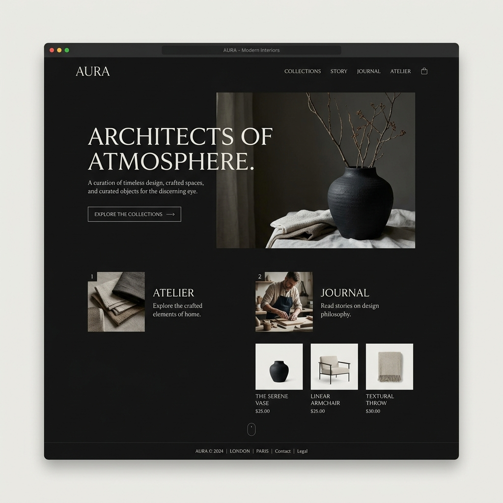

# 🌌 Minimalist Portfolio Collection

A curated collection of high-end, minimalist, and aesthetically pleasing portfolio designs. Built for developers and designers who appreciate typography, whitespace, and subtle motion.



## ✨ Features

- **Premium Aesthetics**: Focus on high-quality typography and balanced layouts.
- **Custom Interactions**: Includes custom cursors, parallax effects, and smooth transitions.
- **Pure Web Technologies**: Built using Vanilla HTML, CSS, and JavaScript.
- **SEO Optimized**: Semantic HTML and meta-tags included for better discoverability.
- **Responsive Design**: Fluid layouts that adapt to any screen size.

## 🎨 Design Showcase

### 1. Ethereal Serif (`design-1.html`)
A sophisticated design focused on negative space and elegant serif typography. Features a custom ring-cursor and subtle parallax interactions.
- **Primary Font**: Cormorant Garamond
- **Aesthetic**: Classic, Timeless, High-end.

### 2. [Coming Soon] Modern Monospace
A brutalist yet clean approach using grid systems and monospace fonts for a technical yet premium feel.

## 🚀 Getting Started

To explore the designs locally:

1. Clone the repository:
   ```bash
   git clone https://github.com/khushaank/portfolio-designs.git
   ```
2. Open `index.html` in your browser to see the main gallery.
3. Explore individual files in the root directory.

## 🛠 Tech Stack

- **HTML5**: Semantic structure.
- **CSS3**: Custom properties, Flexbox, Grid, and Keyframe animations.
- **JavaScript**: Custom cursor logic and scroll interactions.

## 📝 License

This project is licensed under the MIT License. Feel free to use these designs as inspiration for your own work!

---

*Made with 🖤 by [Khushaank Gupta](https://github.com/khushaank)*
